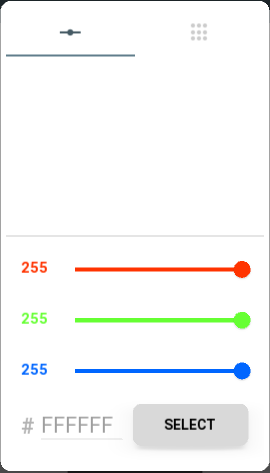
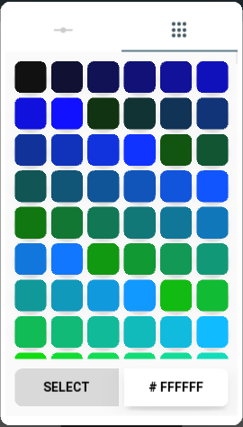

# Material Color Picker

A simple, minimalist and beautiful color picker for kivy based applications.
This color picker is easy to use and integrate into your application to
allow your application users to choose the color in a simple way.

## Upcoming features

    - Get Hex and (A)RGB color codes

    - Separate user interface for portrait and landscape orientation

Design inspiré de [Dribbble](https://dribbble.com/shots/1858968-Material-Design-colorpicker) par Lucas Bonomi

## Requirements

    - kivy >= 2.0.0

    - kivymd >= 0.104.2

---

---

